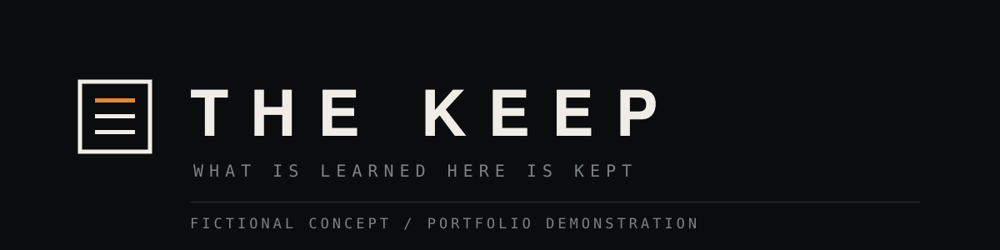

# THE KEEP

**What is learned here is kept.**

A single-page brand experience for a fictional operational training school,
built as a portfolio demonstration. The school does not exist; the institution,
the courses and every line of copy were written for this page.

The page is in Hebrew by default and switches to English from the masthead.

Live: https://elyotam.github.io/THE-KEEP-WEBSITE/

The repository name is capitalised, and GitHub Pages paths are
case-sensitive, so the lowercase spelling of that link does not resolve.

---

## What it is

The page is a scroll-driven film. A 1,175-frame sequence plays in its original
cinematic colour as you scroll, with five statements timed to the scenes beneath
them. The rest of the site sits underneath it: the purpose, the three parts of
the school, a comparison, the method and the close.

Nothing is tinted, graded or overlaid. The palette is taken from the footage
itself: near-black ground, warm off-white, muted steel, and one amber drawn from
the fire in the frames.

## Files

| File | What it does |
| --- | --- |
| `index.html` | The whole page. Semantic, English, one document. |
| `vanta.css` | Every style, on CSS custom properties. No framework. |
| `vanta.js` | Mounts the film, reveals sections on entry, runs the notice. |

The two `vanta.*` filenames are from an earlier version of this page and were
deliberately left alone when the copy changed, so that nothing but the words
moved.
| `film.js` | The frame player. The interesting file; see below. |
| `lang.js` | Hebrew and English, switched in place. |
| `logo.svg` | The mark. Also the favicon. |
| `banner.svg` | The lockup at the top of this file. |
| `a11y.css` / `a11y.js` | The accessibility widget. Self-contained; see below. |
| `frames/` | 1,175 frames at 1344×768, the originals. Not modified. |
| `frames-mobile/` | The same film cropped to portrait at 432×768, for phones. |

There are no dependencies. Two Google fonts are linked; everything else is in
the three files above.

## The frame player

`film.js` is the part worth reading. It was rewritten once after the first
version was smooth on every machine available here and stuck on a real phone,
so the parts that were merely expensive were removed rather than tuned:

- **Sticky, not pinned.** The stage is `position: sticky`, which the compositor
  handles, instead of a pinned element with a spacer that has to be re-measured.
  On a phone the URL bar alone changes the viewport height constantly. Nothing
  in the player reads layout during a scroll.
- **A phone plays a shorter film and holds all of it.** Every tenth frame, at
  the portrait crop, decoded to 320px before it is needed and then kept. That
  is 118 frames, about 2MB over the wire. After that a scrub costs one `drawImage` and
  nothing else, at any speed. Chasing frames during a scroll does not work: when
  it was tried, eleven distinct frames reached the screen over a full scrub.
- **A desktop streams a bounded window.** 1,175 full-size frames are far too
  heavy to hold, so the cache is capped at ninety and biased forward.
- **Decoded off the main thread.** Frames become `ImageBitmap`s, and are
  `close()`d on eviction, because unlike images they are not collected on their
  own.
- **It only draws when the picture changes.** The scroll handler sets a flag;
  one animation frame later, if the index moved, one draw happens.

`window.__film` exposes `{ requested, painted, shown, cached }`, which is the
only honest way to tell whether the thing is a film or a slideshow.

## The accessibility widget

A floating button in the bottom-right corner opens a panel with text scaling
(100/110/120/130%), text spacing, high contrast, invert, grayscale, link and
heading highlighting, a readable font, a large pointer, motion off, larger
click areas and a reading guide, plus an accessibility statement and a reset.
Everything is stored in `localStorage` and restored on the next visit.

It is a drop-in: link `a11y.css` in the head, put `a11y.js` before `</body>`,
and it builds its own markup. To reuse it elsewhere, edit the `CONTACT` block
at the top of `a11y.js` and nothing else. Every class is prefixed `a11y-` and
nothing targets the host page's selectors.

One thing in it is worth knowing about. The colour effects are painted with
`backdrop-filter` on a fixed overlay rather than with `filter` on an ancestor,
because a filter on an ancestor makes `position: fixed` resolve against that
ancestor instead of the viewport. Measured here: `filter` on `<body>` dropped
the fixed masthead 1,600px out of view the moment grayscale was switched on.
The overlay also sits below the widget, so the widget never filters itself.

Text scaling is the other risk on a layout built from `clamp()` and viewport
units, so it is checked at 130% at every width in both languages; there is no
overflow.

## The mark

A record held inside something that does not let go of it. The frame is the
institution, the three bars are the record, and the top one is amber because it
is the entry added most recently: the archive is still being written. Nothing
crosses the frame, which is the argument the whole page makes.

It is drawn on a 64 grid with 4px strokes rather than hairlines, so that it
still reads at 16px in a browser tab.

## Hebrew and English

Hebrew is the page. English lives in `data-en` attributes on the element that
owns the sentence, so a translation cannot drift away from the line it
translates: the two are the same element. There is no dictionary file
to keep in step, and nothing can be missed or translated twice. `lang.js`
handles four attributes (`data-en`, `data-en-alt`, `data-en-aria`,
`data-en-content`), which covers everything including the `<title>`.

The choice is stored, and an inline script in the head applies it before the
first paint, so a returning visitor never sees a frame of the wrong language.
`?lang=he` and `?lang=en` override it.

The layout was written with logical properties, so Hebrew needed only five
declarations changed: the two progress bars, the skip link, and the direction
of the flow arrow in the process row.

## Preview

Any static server, from the repository root:

```sh
python -m http.server 8094
```

Then open <http://127.0.0.1:8094/>. There is no build step. What is in the
repository is what GitHub Pages serves.

## Measured, not assumed

Checked with Playwright at 1440, 1024, 768, 390 and 320:

- no horizontal overflow, no console errors, nothing 404ing
- every run of text on the flat sections clears WCAG AA against what is painted
  behind it
- the narration over the footage is measured by photographing each line, then
  hiding that one element and photographing the same rectangle again: the
  pixels that changed are the letters, and nothing else is. Ink is the glyph
  cores; ground is the ring just outside them. Every percentile shortcut tried
  before this was wrong in both directions. It called a readable label 1.74:1
  because the element's box was mostly bare photograph, and then called
  readable lines 2.3:1 because a light fitting sat inside the crop
- the film scrubs, measured on the live site with a software GPU, at 60fps
  unthrottled (119 of 119 frames reaching the screen), 52fps at a 6× CPU
  throttle (116 frames) and 47fps at a brutal 10× throttle (111 frames)
- a 10×-throttled device has the whole film fetched and decoded about 7 seconds
  after the page opens, and everything else in about 3. Until then the opening
  card is up and the hero frame is what is on screen; a scrub begun before that
  is the one case that can still stutter
- the notice opens, takes focus, and closes on Escape and on its button
- `prefers-reduced-motion` gets one still frame and every statement visible at
  once, with no scrubbing

## Honest by construction

No link on this page goes anywhere outside it. There is no form, no application
route, no fabricated graduate, accreditation, metric or testimonial, and no claim
of any real affiliation with any service, unit or institution. The one button
opens a notice saying exactly what the page is.
